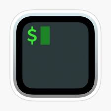

## Hi, 👋  I'm <a href="https://moselikk.com/" target="_blank">Lee</a>

 〽️ Sometimes I may look dull. But when you get to know me better you'll see that I'm pretty interesting in fact.

 💾 &nbsp<a href="https://www.moselikk.com">moselikk's blog</a>

 🧮 &nbsp<a href="https://leetcode.cn/u/moselikk">leetcode</a>

<h4 align="center" >Tools and Environments</h4>

<code></code>
<code></code>
<code></code>
<code></code>
<code></code>
<code></code>
<code></code>
<code></code>
<code></code>
<code></code>

<!--

**moselikk/moselikk** is a ✨ _special_ ✨ repository because its `README.md` (this file) appears on your GitHub profile.

Here are some ideas to get you started:

- 🔭 I’m currently working on ...
- 🌱 I’m currently learning ...
- 👯 I’m looking to collaborate on ...
- 🤔 I’m looking for help with ...
- 💬 Ask me about ...
- 📫 How to reach me: ...
- 😄 Pronouns: ...
- ⚡ Fun fact: ...
-->
